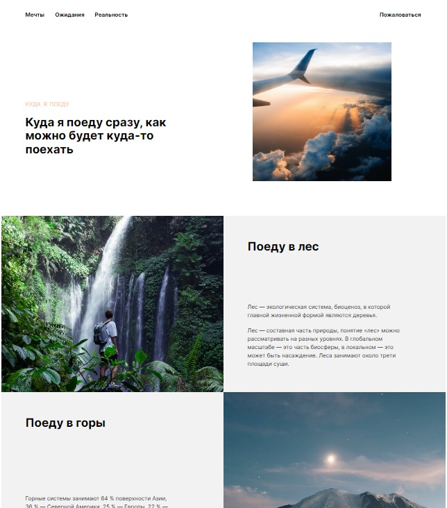

# Куда я поеду

Проект представляет из себя одностраничный сайт, адаптированный под любые разрешения современных устройств

## [Демонстрация сайта](https://8gato8.github.io/kuda-ya-poedu/)
 

  

 
**Использованы следующие методы и технологии:**
    
- HTML
- CSS
- Flexbox layout
- Grid layout
- [Методология BEM](https://ru.bem.info/methodology/ "Использована классическая схема организации файловой структуры БЭМ-проектов: Nested")
- Media queries

## Статус проекта и планы по доработке
Завершён. Доработки не планируются.
